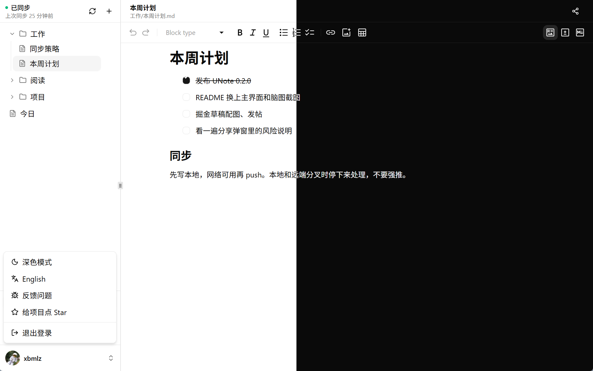

<p align="center">
  
</p>

<h1 align="center">UNote</h1>

<p align="center">
  Git-first desktop notes. Your files stay in <strong>your</strong> private Git repository.
</p>

<p align="center">
  English ·
  <a href="./README.zh-CN.md">简体中文</a>
</p>

<p align="center">
  <a href="https://github.com/unote-dev/unote/actions/workflows/ci.yml"></a>
  <a href="https://github.com/unote-dev/unote/actions/workflows/release.yml"></a>
  <a href="https://github.com/unote-dev/unote/releases/latest"></a>
  <a href="https://github.com/unote-dev/unote/releases/latest"></a>
  
</p>

<p align="center">
  
</p>

## Features

- **Markdown** — rich editing on top of real `.md` files ([MDXEditor](https://www.mdxeditor.dev/))
- **Canvas** — freeform drawing ([Excalidraw](https://excalidraw.com/))
- **Mind maps** — node-based outlines ([Mind Elixir](https://docs.mind-elixir.com/))
- **Diagrams** — Draw.io via [diagrams.net](https://www.diagrams.net/)
- **Folders** — nested directories, no extra metadata layer
- **Trash** — deleted notes move to `.trash` in the repo
- **Git sync** — edit locally first, then commit and push
- **Share** — read-only Cloudflare Quick Tunnel snapshot; the key stays in the URL fragment (`#…`)
- **i18n** — Chinese and English UI
- **Assets** — images live in `.assets/` and can be referenced from notes
- **Themes** — light, dark, or follow the system
- **Updates** — in-app check against the latest GitHub Release

## Install

Download the Windows NSIS installer from [Releases](https://github.com/unote-dev/unote/releases/latest).

macOS and Linux builds are not available yet.

## Git providers

| Provider | Status |
| -------- | ------ |
| Gitee | Supported |
| GitHub | Planned |
| GitLab | Planned |

## Development

Requirements:

- [Node.js](https://nodejs.org/) 22+
- [pnpm](https://pnpm.io/)
- [Rust](https://www.rust-lang.org/) + MSVC (Windows)
- [Tauri 2 prerequisites](https://v2.tauri.app/start/prerequisites/)

Create a Gitee OAuth app with callback `http://127.0.0.1:17331/callback`, put the credentials in `src-tauri/src/constants.rs`, then:

```bash
pnpm install
pnpm tauri dev
```

### Checks

```bash
pnpm lint
pnpm test
pnpm build
cd src-tauri && cargo test
```

### Release

```bash
pnpm tauri build
```

Pushing a `v*.*.*` tag runs GitHub Actions, which builds the NSIS installer and publishes a Release. See [docs/RELEASING.md](docs/RELEASING.md).

## Tech stack

| Layer | Stack |
| ----- | ----- |
| Desktop | [Tauri 2](https://v2.tauri.app/) |
| Frontend | React 19, TypeScript, Vite |
| UI | Tailwind CSS 4, [shadcn/ui](https://ui.shadcn.com/) |
| Markdown | [MDXEditor](https://www.mdxeditor.dev/) |
| Canvas | [Excalidraw](https://excalidraw.com/) |
| Mind maps | [Mind Elixir](https://docs.mind-elixir.com/) |
| Backend | Rust (`git2`, `reqwest`, `keyring`) |
| Auth | OAuth 2.0, credentials in the system keyring |
| Sync | Git (libgit2) |

## License

MIT
