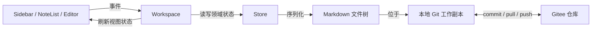
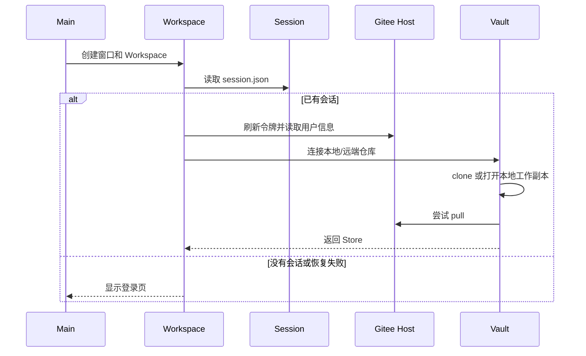
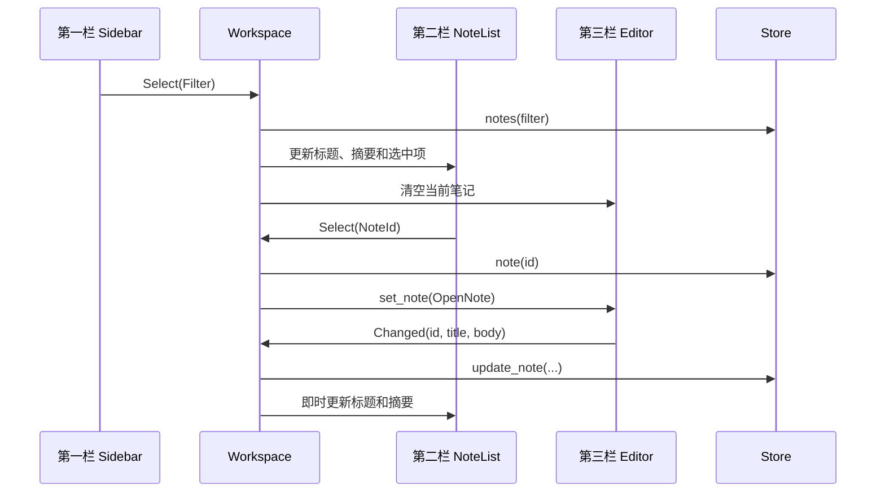
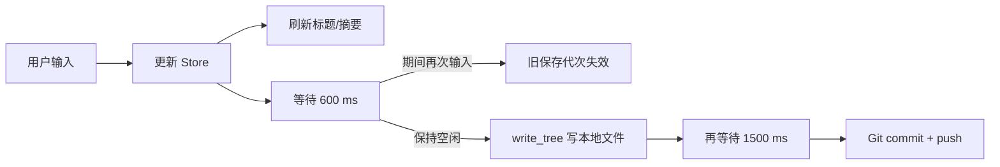

# unote 实现原理与运行流程

本文面向需要维护或继续开发 unote 的开发者。阅读本文只需要了解 Rust、事件驱动 UI 和 Git 的基本概念。

## 1. 整体思路

unote 是一个“本地优先、Git 同步”的桌面 Markdown 笔记应用：

- UI 使用 GPUI 与 GPUI Kit 构建。
- 运行时数据由内存中的 `Store` 统一管理。
- 每篇笔记保存为普通 Markdown 文件，笔记本关系保存在 `notebooks.json`。
- 本地仓库是真正的工作副本；Gitee 负责远端备份和多端同步。
- `Workspace` 是应用协调层，订阅各栏事件并串联状态、文件和网络操作。

核心数据流如下：



## 2. 模块职责

| 模块 | 职责 |
| --- | --- |
| `main.rs` | 初始化组件库、资源和快捷键，创建主窗口。 |
| `workspace.rs` | 应用协调器；持有全局状态，订阅 UI 事件，驱动保存和同步。 |
| `domain.rs` | `Note`、`Notebook`、ID 与 `Filter` 等领域类型。 |
| `store.rs` | 内存数据模型；查询、创建、重命名、回收和恢复都在这里完成。 |
| `sidebar.rs` | 第一栏；显示全部笔记、普通笔记本、回收站和账号入口。 |
| `note_list.rs` | 第二栏；搜索、摘要列表、选择笔记和新建入口。 |
| `editor.rs` | 第三栏；标题、正文、Markdown 预览和三种查看模式。 |
| `markdown.rs` | `Store` 与磁盘文件树之间的编解码。 |
| `vault.rs` | 本地 Git 工作副本、提交、拉取和推送。 |
| `host/` | Git 托管平台抽象与 Gitee OAuth/API 实现。 |
| `session.rs` | 登录会话的本地持久化以及仓库路径计算。 |
| `assets.rs` | 内置图片和 SVG 资源加载。 |

依赖方向有意保持为：视图发事件，`Workspace` 做编排，`Store` 管业务状态，`markdown` 和 `Vault` 管持久化。视图不会直接操作 Git 或文件系统。

## 3. 数据模型与磁盘格式

### 3.1 内存模型

`Store` 持有三类状态：

- `notebooks: Vec<Notebook>`：全部笔记本，包括回收站中的笔记本。
- `notes: Vec<Note>`：全部笔记内容。
- `inbox_id: NotebookId`：持久化的默认笔记本指针；当前“全部笔记”中新建时实际选择第一个未回收笔记本。

`Note` 包含标题、Markdown 正文、所属笔记本和更新时间。`Notebook` 包含 ID、名称以及 `trashed` 标记。回收笔记本时不会移动或删除它的笔记，只把笔记本标记为已回收。

`Filter` 表示第二栏当前显示什么：

- `All`：所有未回收笔记本中的笔记。
- `Notebook(id)`：一个普通笔记本。
- `Trash`：所有已回收笔记本中的笔记。
- `TrashNotebook(id)`：某个已回收笔记本中的笔记。

列表查询按 `updated_at` 倒序返回，所以最近编辑的笔记排在最前。

### 3.2 文件树

登录后，本地数据位于应用数据目录下的 Git 工作副本中：

```text
repos/
└── gitee/<用户名>/<仓库名>/
    ├── .git/
    ├── notebooks.json
    ├── notebook-<id>/
    │   ├── note-<id>.md
    │   └── ...
    └── ...
```

`notebooks.json` 保存默认笔记本 ID、笔记本名称和回收状态。每篇笔记是独立的 Markdown 文件：

```markdown
---
title: 示例标题
updated_at: 123456789
---

这里是 Markdown 正文。
```

文件夹名和文件名使用稳定 ID，重命名笔记本或笔记标题不会改变路径。这样可以减少 Git 中无意义的文件移动。

`markdown::read_tree` 从元数据和各笔记本目录重建 `Store`；`write_tree` 写回元数据与全部笔记，并清理已经不再存在的笔记文件。`trashed` 使用 Serde 默认值，因此旧版 `notebooks.json` 没有该字段时会按“未删除”读取。

## 4. 启动和登录流程



首次登录由 `Login::start` 在后台执行：

1. 在 `127.0.0.1:17331` 启动临时 OAuth 回调监听。
2. 打开浏览器进入 Gitee 授权页。
3. 校验回调中的 `state`，使用授权码换取 token。
4. 获取 Gitee 用户信息并创建目标笔记仓库。
5. 将会话写入 `session.json`。
6. `Vault::connect` clone 或初始化工作副本，并读取笔记文件树。
7. `LoginEvent::Ready` 通知 `Workspace` 切换到三栏界面。

目前 `GitHost` trait 已为多个托管平台预留统一接口，但只有 Gitee 标记为可用。

## 5. 三栏界面如何协作

三个视图都是独立 GPUI Entity，通过事件与 `Workspace` 通信：



`Workspace` 同时负责布局模式。正常模式显示三栏；隐藏侧栏时只隐藏第一栏；专注模式只保留编辑器。第一、第二栏使用可调整宽度的面板。

第二栏使用虚拟列表。每一行高度固定，标题限制一行，摘要限制两行，从而满足虚拟列表等高布局的要求。搜索只过滤当前载入的 `NoteRow`，不会访问磁盘或网络。

第三栏保存一个标题输入框和正文输入框，并支持：

- 编辑：只显示 Markdown 源码。
- 分栏预览：左侧源码、右侧渲染结果。
- 预览：只显示渲染结果。

输入组件的变化统一转成 `EditorEvent::Changed`，编辑器自身不直接保存文件。

## 6. 新建、编辑与自动保存

### 新建笔记

1. `Workspace` 根据当前 `Filter` 调用 `notebook_for_new_note`。
2. 在普通笔记本中，新笔记进入当前笔记本；在“全部笔记”中进入第一个有效笔记本。
3. 回收站中不允许新建笔记。
4. `Store::create_note` 生成基于时间戳的 ID，插入空笔记。
5. 第二栏刷新并选中新笔记，第三栏打开编辑。
6. 触发本地持久化。

如果当前没有普通笔记本，必须先创建笔记本。

### 自动保存

每次标题或正文变化都会先立即更新内存和第二栏摘要，然后进入防抖保存：



`save_gen` 和 `sync_gen` 是递增的代次号。新的输入会使旧任务的代次号失效，因此连续打字不会逐键写盘或逐键提交。第三栏只在实际等待本地写入时显示“保存中”。

## 7. Git 同步流程

同步分为两种：

- 编辑后的空闲同步：`vault.sync`，执行本地提交后直接 push，不主动 pull。
- 手动同步和每 120 秒的周期同步：`vault.sync_remote`，依次执行 commit、pull、push，然后重新从磁盘加载 `Store`。

`request_sync` 会先确保最新内存状态已经写入文件，再把 Git 操作放到后台执行。同步成功且发生过 pull 时，`replace_store` 用磁盘内容替换内存状态，同时尽量保留当前打开的笔记。

拉取只接受两种情况：远端已是最新，或可以 fast-forward。检测到分叉时不会自动合并 Markdown，而是返回错误，避免静默覆盖两端修改。

当前提交身份固定为 `unote <unote@local>`，提交消息由操作类型决定。Git 因此既承担同步机制，也保留文件级历史，但应用级恢复仍优先使用回收站。

## 8. 笔记本和回收站流程

### 新建与重命名

第一栏发出创建或重命名事件，`Workspace` 打开输入对话框。确认后由 `Store` 修改内存状态，刷新三栏并触发持久化。第一个普通笔记本会自动成为默认笔记本。

### 移到回收站

1. 用户在普通笔记本菜单选择删除。
2. 确认后调用 `Store::trash_notebook`，只设置 `trashed = true`。
3. 如果它原来是默认笔记本，则选择另一个普通笔记本作为默认值；没有可用笔记本时默认 ID 为空。
4. 笔记本从普通区域消失，出现在“已删除笔记本”区域，其笔记可在回收站查看。
5. 文件仍保留在原目录，下一次保存和 Git 同步只记录元数据变化。

### 恢复与永久删除

恢复会清除 `trashed` 标记，并把筛选切回该笔记本。若此前没有普通笔记本，被恢复的笔记本会成为默认笔记本。

永久删除只允许作用于已进入回收站的笔记本。执行时先删除对应目录，再从 `Store` 移除笔记本及其全部笔记，随后保存并同步。Git 历史仍可作为最后的人工恢复手段。

## 9. 异步、一致性与错误处理

- 文件和网络操作不在 UI 渲染函数中执行。
- `busy` 防止登录按钮重复提交，`syncing` 防止并行 Git 同步。
- 保存和同步代次号避免过期异步任务覆盖新状态。
- 登录时 pull 失败会退回本地缓存；这样离线时仍有机会打开已有笔记。
- 同步分叉不会自动合并，当前需要在托管平台或 Git 工具中人工处理。
- 保存和同步错误会进入 `SyncStatus::Error` 并写入标准错误输出。

需要注意：`session.json` 当前包含 OAuth token 和应用凭据，属于本机敏感文件；生产化时应考虑使用系统凭据存储。Markdown 写入目前也不是事务式写入，进程在多文件写入中途退出时，可能留下部分更新。

## 10. 测试与扩展入口

现有测试主要覆盖：

- Store 的筛选、创建、重命名、回收、恢复和永久删除。
- Markdown 文件树的往返、旧字段兼容和全回收边界情况。
- Git 本地提交的幂等性。
- 第二栏虚拟列表的固定行高和无重叠。
- 自动保存防抖参数关系。
- 应用资源加载。

继续扩展时，优先沿现有边界添加能力：

- 新托管平台：实现 `GitHost`，不要把平台判断写入 `Vault`。
- 新笔记查询：扩展 `Filter` 与 `Store::notes`，视图只消费结果。
- 新持久化字段：在领域模型和 `notebooks.json` 中提供 Serde 默认值，保证旧仓库可读。
- 新编辑模式：扩展 `Editor` 的模式状态，不让 `Workspace` 了解具体渲染细节。

这种分层的核心价值是：UI、领域状态、磁盘格式和 Git 同步可以分别演进，而所有跨层流程仍集中在 `Workspace` 中可追踪。
