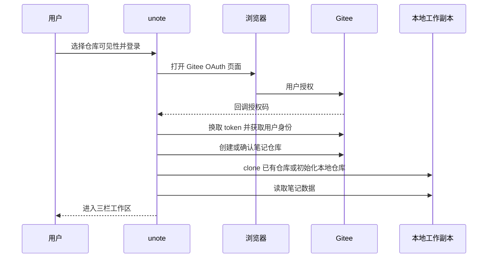
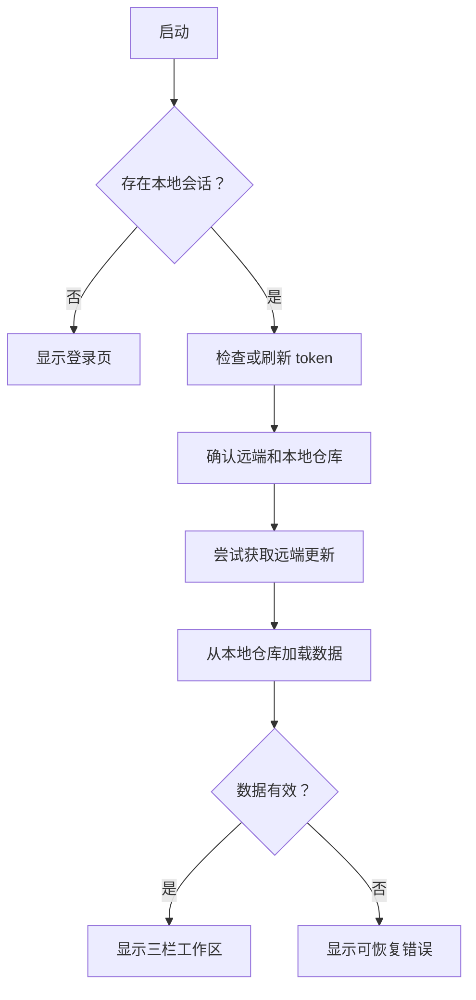
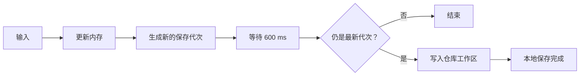
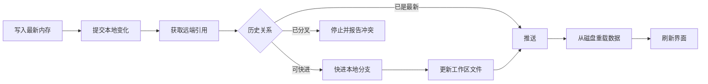

# unote 产品与数据同步规格

> 本文是语言无关的实现规格。任何开发者或 Agent 都应能够只依据本文，在任意桌面 UI 技术栈中实现一个数据兼容、行为一致的 unote。

## 1. 产品定义

unote 是一个本地优先、Markdown 原生、通过 Git 仓库同步的个人笔记应用。

它不是 Notion 的缩小复刻。Notion 以云端工作区、页面块、数据库和多人协作为中心；unote 以本机文件、直接写作、可检查的数据格式和用户拥有的 Git 仓库为中心。

unote 的核心承诺是：

- 没有网络时，用户仍能读取和编辑完整笔记库。
- 每篇笔记始终是普通 Markdown 文件。
- 用户可以脱离 unote，用文本编辑器和 Git 工具继续访问数据。
- Gitee 不只是备份位置，也是跨设备同步和版本历史载体。
- 日常删除通过回收站恢复；Git 历史承担最终兜底。

## 2. 与 Notion 的特点和差异

以下对比基于 Notion 官方说明。Notion 的能力会更新，引用资料只用于说明产品边界，不要求 unote 追随 Notion 的功能变化。

| 维度 | unote | Notion | 设计意义 |
| --- | --- | --- | --- |
| 核心形态 | 笔记本中的 Markdown 笔记 | 由内容块组成的页面和工作区 | unote 优先长文本写作，不实现通用块编辑器。 |
| 数据归属 | 本机目录和用户自己的 Git 仓库 | 主要存储在 Notion 云端，也可导出 | unote 的工作格式就是可携带格式，不需要先导出。 |
| 离线模型 | 整个本地仓库天然可用 | 桌面和移动端可下载页面离线使用；部分页面会自动下载 | unote 不区分“已下载”和“未下载”页面。 |
| 组织方式 | 扁平笔记本，一篇笔记只属于一个笔记本 | 页面可嵌套；数据库可包含属性并提供多种视图 | unote 用较低的组织复杂度换取更直接的写作体验。 |
| 数据库能力 | 不提供 | 数据库项目也是页面，可配置属性、筛选、排序以及表格、列表、看板、日历、时间线等视图 | unote 不承担项目管理、CRM 或复杂知识库用途。 |
| 协作 | 当前定位为个人、多设备使用 | 支持共享、权限和实时多人协作 | unote 不实现实时光标、细粒度权限或块级协作。 |
| 同步 | Git 提交、拉取和推送；历史公开可检查 | 应用内部自动同步，文本冲突可尝试自动解决 | unote 的同步更透明，但发生分叉时需要显式处理。 |
| 历史 | Git 提交历史，不依赖订阅档位 | 页面历史和云端备份能力受产品规则和方案影响 | unote 的历史可以用任何 Git 工具读取。 |
| 删除恢复 | 应用回收站 + Git 历史 | 页面默认在回收站保留一段时间，并提供页面历史及云端备份恢复 | unote 不自动按天清空回收站，永久删除后仍可能从 Git 恢复。 |
| 可迁移性 | 仓库本身就是 Markdown 数据源 | 支持导出 Markdown、HTML、CSV 等，但导出结果不能直接完整重建工作区 | unote 强调无导出步骤和格式长期可读。 |

Notion 官方资料：

- [离线页面](https://www.notion.com/help/use-pages-offline)
- [数据库基本概念](https://www.notion.com/help/what-is-a-database)
- [备份、导出与恢复](https://www.notion.com/help/back-up-your-data)
- [实时协作](https://www.notion.com/en-gb/help/collaborate-within-a-workspace)

### unote 的优势

- 数据透明：仓库里没有必须依赖特定服务才能读取的正文格式。
- 本地优先：启动、浏览、搜索和编辑不以远端在线为前提。
- 历史透明：每次同步对应 Git 提交，可用成熟工具检查和恢复。
- 低复杂度：没有块、属性、数据库视图和权限体系。
- 易于自动化：普通文件可被脚本、Agent、编辑器和静态站点工具直接处理。

### unote 的取舍

- 不具备 Notion 的实时协作、数据库、多视图和丰富嵌入能力。
- Git 对非技术用户并不天然友好，因此应用必须隐藏大多数 Git 细节。
- 多设备同时编辑可能形成分叉，当前不自动合并。
- Markdown 无法无损表达所有富文本和结构化数据库能力。

## 3. 规范用语

本文使用以下约束级别：

- **MUST**：数据兼容或核心行为要求，不可省略。
- **SHOULD**：推荐行为；只有明确理由时才可偏离。
- **MAY**：可选增强，不影响基础兼容性。

## 4. 业务对象

### 4.1 笔记

一篇笔记包含：

| 字段 | 含义 | 约束 |
| --- | --- | --- |
| `id` | 稳定唯一标识 | 创建后 MUST 不变，并用于文件名。 |
| `title` | 显示标题 | MUST 是单行；写入前移除换行。 |
| `body` | Markdown 正文 | MUST 保留用户原始 Markdown 文本。 |
| `notebook_id` | 所属笔记本 | MUST 指向一个存在的笔记本。 |
| `updated_at` | 最后更新时间 | Unix 时间数值，用于倒序排列。 |

一篇笔记 MUST 只属于一个笔记本。当前不支持标签、状态、多归属或页面嵌套。

### 4.2 笔记本

一个笔记本包含：

| 字段 | 含义 | 约束 |
| --- | --- | --- |
| `id` | 稳定唯一标识 | 创建后 MUST 不变，并用于目录名。 |
| `name` | 显示名称 | 用户可修改；重命名 MUST 不改变目录名。 |
| `trashed` | 是否在回收站 | 缺失时 MUST 按 `false` 处理。 |

笔记本是扁平结构。初始笔记库 MUST 为空，不自动创建系统笔记本。

### 4.3 默认笔记本

元数据中保存 `inbox_id`，表示默认笔记本候选。

- 它 MUST 指向正常状态的笔记本，或在没有正常笔记本时为空字符串。
- 删除当前默认笔记本时，系统 MUST 选择另一个正常笔记本。
- 恢复或新建第一个正常笔记本时，它 MUST 成为默认笔记本。
- 从“全部笔记”新建笔记时，SHOULD 优先使用 `inbox_id`；若其无效，则使用第一个正常笔记本并修正元数据。

### 4.4 筛选范围

应用至少支持四种列表范围：

- 全部正常笔记。
- 某个正常笔记本中的笔记。
- 回收站中的全部笔记。
- 某个已删除笔记本中的笔记。

所有列表 MUST 按 `updated_at` 从新到旧排列。

## 5. Git 仓库的作用

Git 仓库同时承担四个角色。

### 5.1 主数据容器

笔记正文、笔记本元数据和回收状态都在仓库中。远端数据库不是笔记内容的必要依赖。

### 5.2 多设备同步媒介

每台设备维护同一远端仓库的本地工作副本。设备通过 pull 获取其他设备的提交，通过 push 上传本机提交。

### 5.3 版本历史

有效的数据变化形成提交。即使应用回收站已经永久删除内容，仍可能通过 Git 历史恢复旧文件。

### 5.4 开放接口

其他工具可以直接读取、搜索、转换或发布 Markdown 文件。Git 仓库因此也是面向外部工具的稳定数据接口。

## 6. 本机目录结构

应用数据目录和笔记仓库必须分开理解：会话属于本机，笔记内容属于 Git 仓库。

```text
<app-data>/
├── session.json
└── repos/
    └── <host>/
        └── <login>/
            └── <repository>/
                ├── .git/
                ├── notebooks.json
                ├── <notebook-id>/
                │   ├── <note-id>.md
                │   └── ...
                └── ...
```

路径规则：

- `<app-data>` MUST 使用操作系统推荐的应用数据目录。
- `<host>` 当前为 `gitee`。
- `<login>` 是托管平台登录名。
- `<repository>` 当前命名为 `<login>.<host>.unote`。
- `session.json` MUST 位于 Git 仓库外，绝不能提交到远端。
- `.git`、`notebooks.json` 和笔记本目录 MUST 位于同一个仓库根目录。

示例：

```text
<app-data>/repos/gitee/alice/alice.gitee.unote/
├── .git/
├── notebooks.json
├── notebook-1730000000000000000/
│   ├── note-1730000000000000001.md
│   └── note-1730000000000000002.md
└── notebook-1730000000000000003/
    └── note-1730000000000000004.md
```

## 7. 仓库数据格式

### 7.1 `notebooks.json`

仓库根目录 MUST 包含 `notebooks.json`。格式如下：

```json
{
  "inbox_id": "notebook-1730000000000000000",
  "notebooks": [
    {
      "id": "notebook-1730000000000000000",
      "name": "工作",
      "trashed": false
    },
    {
      "id": "notebook-1730000000000000003",
      "name": "旧项目",
      "trashed": true
    }
  ]
}
```

兼容规则：

- `trashed` 缺失时 MUST 视为 `false`。
- `notebooks` 为空时，`inbox_id` MUST 允许为空字符串。
- `inbox_id` 无效、指向已删除笔记本或缺失时，读取方 SHOULD 选择第一个正常笔记本；没有正常笔记本时使用空字符串。
- 未识别字段 SHOULD 忽略，以便以后扩展格式。
- 元数据写入 SHOULD 使用 UTF-8 和稳定、易读的缩进。

### 7.2 Markdown 笔记文件

每篇笔记保存为 `<notebook-id>/<note-id>.md`。文件 MUST 使用 UTF-8，格式如下：

```markdown
---
title: 一条示例笔记
updated_at: 1730000000000000000
---

这里是 **Markdown** 正文。
```

解析规则：

1. 文件 MUST 以 `---` 和换行开始。
2. 文件头 MUST 由下一行独立的 `---` 结束。
3. 必须识别 `title:` 和 `updated_at:`。
4. `title` 取冒号后的去首尾空白文本。
5. `updated_at` 解析为无符号整数；无效值 MAY 降级为 `0`。
6. 文件头后的一个空行不属于正文。
7. 文件名去掉 `.md` 后得到 `note.id`。
8. 父目录名得到 `note.notebook_id`。
9. 未识别的文件头字段 SHOULD 忽略。

写入规则：

- 标题中的 `\r` 和 `\n` MUST 替换为空格。
- 正文内容 SHOULD 原样保存。
- 笔记本重命名 MUST 不移动目录。
- 标题修改 MUST 不重命名文件。
- 只有永久删除笔记本时才能删除整个笔记本目录。

### 7.3 ID 和时间

ID MUST 在单个仓库中唯一、可安全作为目录或文件名，并在创建后保持不变。

当前兼容格式使用：

- 笔记本：`notebook-<高精度 Unix 时间数值>`
- 笔记：`note-<高精度 Unix 时间数值>`

其他语言可以使用同样格式，也可以生成更可靠的唯一数值；但不得包含路径分隔符，且 MUST 保持上述前缀。

`updated_at` 是用于排序和变化记录的 Unix 时间数值。当前兼容格式使用纳秒；其他实现 MUST 继续写入纳秒值，避免不同客户端的排序尺度不一致。

### 7.4 本机会话格式

`session.json` 不属于仓库协议，但兼容客户端需要保存以下信息：

```json
{
  "host": "gitee",
  "login": "alice",
  "name": "Alice",
  "avatar_url": "https://example.com/avatar.png",
  "repo": "alice.gitee.unote",
  "public": false,
  "token": {
    "access_token": "<secret>",
    "refresh_token": "<secret-or-null>",
    "expires_at": 1730000000
  },
  "client_id": "<oauth-client-id>",
  "client_secret": "<oauth-client-secret>"
}
```

`expires_at` 使用 Unix 秒。实现 MAY 采用不同的本机会话格式或系统安全存储，但仓库内绝不能出现上述凭据。

## 8. 内存状态和磁盘状态

每个运行中的客户端维护一份完整内存状态，用于快速渲染和编辑。

数据优先级为：

1. 用户正在编辑的内存状态。
2. 本地仓库工作区中的文件。
3. 本地 Git 提交历史。
4. Gitee 远端 Git 历史。

用户输入 MUST 先更新内存和界面，再异步写入本地。网络操作 MUST 不阻塞输入。

磁盘重新加载时，必须用 `notebooks.json` 建立笔记本集合，再扫描每个已登记笔记本目录中的 `.md` 文件。未登记目录 SHOULD 忽略，避免意外导入无关文件。

## 9. 首次登录与仓库建立



必须遵守：

- OAuth MUST 使用随机且一次性的 `state` 防止伪造回调。
- 回调 MUST 校验 `state`，再交换 token。
- 会话信息 MUST 保存在仓库之外。
- token 临近过期时 SHOULD 使用 refresh token 更新。
- 目标仓库不存在时 MUST 按用户选择创建私有或公开仓库。
- 默认 MUST 创建私有仓库。
- 本地仓库不存在时优先 clone；远端尚无有效分支时 MAY 初始化空仓库。

### 9.1 Gitee 兼容参数

当前兼容客户端使用以下约定：

- OAuth 回调：`http://127.0.0.1:17331/callback`
- 授权范围：`user_info projects`
- 授权地址：`https://gitee.com/oauth/authorize`
- token 地址：`https://gitee.com/oauth/token`
- 用户信息：`https://gitee.com/api/v5/user`
- Git 地址：`https://gitee.com/<login>/<repository>.git`
- Git HTTPS 用户名：`oauth2`

OAuth Client ID 和 Secret 属于应用发行配置，不属于笔记仓库。不同发行版 MAY 使用自己的 OAuth 应用，但回调地址必须与 Gitee 应用配置一致。

## 10. 启动流程



启动时 pull 失败但本地仓库有效，应用 SHOULD 使用本地数据进入离线状态。

读取失败时 MUST 保留原文件并显示错误。禁止因为元数据解析失败就用空笔记库覆盖原仓库。

## 11. 编辑和本地保存

### 11.1 即时更新

标题或正文发生变化时：

1. 立即更新内存中的笔记。
2. 更新该笔记的 `updated_at`。
3. 立即刷新第二栏标题和摘要。
4. 将本次变化标记为待保存。

### 11.2 防抖保存

本地保存 MUST 防抖，避免逐键写盘。兼容行为为最后一次输入后约 `600 ms` 保存。

每次变化生成新的保存代次。等待结束时，任务只有在自己的代次仍为最新时才能写盘；过期任务必须直接结束。



写盘时 MUST：

- 重写 `notebooks.json`。
- 写入全部正常和已删除笔记本中的笔记。
- 删除仍属于已登记笔记本、但已经不在内存状态中的旧 `.md` 文件。
- 不删除未登记目录或非 `.md` 文件。

## 12. Git 同步状态机

### 12.1 同步状态

客户端至少维护以下状态：

- `Idle`：未登录或未开始同步。
- `Saved`：本地文件已保存，尚未确认远端同步。
- `Syncing`：正在进行 Git 操作。
- `Synced`：本地与已知远端状态已完成同步。
- `Error(message)`：最近一次保存或同步失败。

同一时间 MUST 只运行一个 Git 同步任务。

### 12.2 本地变化提交

每次同步开始前 MUST 先把最新内存状态写入工作区，然后执行：

1. 将仓库内全部新增、修改和删除加入暂存区。
2. 生成暂存区树。
3. 与当前 `HEAD` 的树比较。
4. 没有变化时不创建空提交。
5. 有变化时创建新提交。

兼容提交身份：

```text
unote <unote@local>
```

推荐提交消息：

- 普通编辑：`unote: 更新笔记`
- 主动或周期同步：`unote: 同步笔记`

### 12.3 空闲推送

本地保存成功后，客户端等待约 `1500 ms`。期间再次编辑会取消旧的延迟同步。空闲期结束后：


空闲推送不主动 pull，目标是快速上传当前设备刚产生的变化。

### 12.4 完整同步

以下情况触发完整同步：

- 用户手动同步。
- 应用运行期间每约 `120 秒` 的周期同步。
- 启动或重新连接仓库。

完整同步顺序 MUST 为：



### 12.5 分支规则

- 已有本地 `HEAD` 时，MUST 使用当前分支。
- 尚无本地分支时，SHOULD 优先识别远端 `master`，其次 `main`。
- push MUST 将当前本地分支推送到远端同名分支。
- 远端不存在时 MUST 创建 `origin`。

### 12.6 快进规则

pull 后只允许：

- 远端与本地相同：无需移动分支。
- 本地可以直接快进到远端：移动本地分支并更新工作区。

本地与远端都包含对方没有的提交时，视为分叉。当前版本 MUST 停止自动同步，不允许强推、自动 rebase 或静默选择一端。

### 12.7 同步失败

- 网络或认证失败 MUST 保留本地文件和本地提交。
- push 失败 MUST 允许稍后重试，不得回滚本地编辑。
- pull 分叉 MUST 给出明确提示，说明需要处理 Git 分叉。
- 失败后状态 MUST 变为 `Error`，新的编辑仍可本地保存。
- 实现 MAY 提供“重试同步”和“打开本地仓库”入口。

## 13. 多设备场景

### 场景 A：设备 B 没有本地修改

设备 A 编辑并推送。设备 B 执行完整同步时，本地可以快进，因此拉取成功并重新载入新笔记。

### 场景 B：两台设备先后编辑

设备 A 推送完成后，设备 B 先完整同步，再编辑和推送。历史保持线性，同步成功。

### 场景 C：两台设备离线编辑

设备 A 和设备 B 从同一提交分别产生新提交。先推送的一方成功；另一方再次同步时检测到分叉并停止。

当前版本不做内容级自动合并。后续 MAY 在笔记文件互不相同时自动合并，但必须先保留两端提交，且不得丢失数据。

## 14. 回收站流程

### 14.1 移入回收站

普通删除笔记本时：

1. 显示确认对话框。
2. 将该笔记本的 `trashed` 改为 `true`。
3. 不移动目录，不删除笔记文件。
4. 从“全部笔记”和正常笔记本区域隐藏它。
5. 在回收站区域显示它及其笔记。
6. 更新默认笔记本。
7. 保存并同步 `notebooks.json` 的变化。

### 14.2 恢复

恢复时将 `trashed` 改为 `false`。目录和笔记从未移动，所以无需复制数据。

恢复后 SHOULD 自动进入该笔记本。若当前没有其他正常笔记本，它 MUST 成为默认笔记本。

### 14.3 永久删除

永久删除只能用于 `trashed = true` 的笔记本，并 MUST 再次确认。

确认后：

1. 删除 `<notebook-id>/` 整个目录。
2. 从 `notebooks.json` 移除笔记本。
3. 从内存状态移除其全部笔记。
4. 创建包含删除记录的 Git 提交。
5. 推送远端。

Git 历史仍能恢复旧目录，但产品文案不得把它描述为日常的一键恢复功能。

## 15. 三栏业务交互

### 第一栏

MUST 包含：

- 全部笔记。
- 始终可见的新建笔记本入口。
- 正常笔记本列表。
- 回收站入口。
- 已删除笔记本列表及恢复、永久删除菜单。
- 单行账号信息和退出登录入口。

### 第二栏

MUST 包含：

- 当前范围名称。
- 新建菜单；回收站中不得显示新建笔记。
- 当前范围内的搜索。
- 按更新时间倒序的笔记列表。
- 每项一行标题和最多两行摘要。
- 固定且一致的行高，禁止相邻内容重叠。

摘要 SHOULD 从正文中移除常见 Markdown 行首符号、忽略空行、合并为单行，并限制长度。

### 第三栏

MUST 包含：

- 左侧笔记标题。
- 右侧编辑、分栏预览、预览三个图标模式。
- 编辑中的 Markdown 文本。
- 可滚动的 Markdown 预览。
- 本地保存期间短暂显示的“保存中”提示。

## 16. 搜索与排序

搜索作用于当前筛选范围，而不是整个仓库。至少匹配标题和摘要，比较时 SHOULD 忽略大小写。

搜索不改变底层数据，只生成临时结果。清空搜索后 MUST 恢复当前范围的完整列表。

排序使用 `updated_at` 倒序。实现 SHOULD 在编辑后及时调整顺序；若为避免光标跳动而延迟排序，至少在重新进入范围或同步重载后保证正确顺序。

## 17. 安全与隐私

- 仓库默认 MUST 为私有。
- 用户选择公开仓库时 MUST 明确提示任何人可能读取笔记。
- OAuth token、refresh token 和应用凭据 MUST 不进入 Git 仓库。
- 生产实现 SHOULD 使用操作系统安全凭据存储，而不是明文会话文件。
- 日志 MUST 不输出 token、授权码或完整认证 URL。
- 永久删除失败时 MUST 保持数据仍在回收站，并显示错误。

## 18. 非目标

首个兼容版本不要求实现：

- Notion 式块编辑器。
- 页面嵌套和双向链接。
- 数据库属性、公式、关系和多视图。
- 实时多人协作。
- 细粒度共享权限。
- 附件同步和富媒体资源管理。
- 自动解决 Git 分叉。
- 服务端全文搜索。

## 19. 最小验收清单

一个实现只有满足以下条件，才能称为兼容的 unote：

- [ ] 空白启动时没有预置笔记本。
- [ ] 可以创建、重命名、回收、恢复和永久删除笔记本。
- [ ] 可以创建、选择和编辑 Markdown 笔记。
- [ ] 三种编辑/预览模式工作正常。
- [ ] 笔记以本文规定的目录和 Markdown 格式保存。
- [ ] 旧元数据缺少 `trashed` 时仍能读取。
- [ ] 连续输入不会逐键写盘或逐键 Git 提交。
- [ ] 本地保存不依赖网络。
- [ ] 空闲后可以提交并推送本地变化。
- [ ] 手动和周期同步可以拉取可快进的远端提交。
- [ ] Git 分叉时停止同步且不丢失任何一端数据。
- [ ] 回收站操作不移动或删除 Markdown 文件。
- [ ] 永久删除会删除目录并形成 Git 历史。
- [ ] 登录凭据永远不进入笔记仓库。
- [ ] 断网时可以打开并编辑已有本地笔记库。

## 20. 实现顺序建议

不同语言和 UI 框架可以采用相同的垂直实现顺序：

1. 实现本文的数据对象、目录结构和文件编解码。
2. 实现纯本地的新建、编辑、筛选和回收站。
3. 实现防抖保存并验证关闭重开后数据一致。
4. 实现本地 Git 提交，确保不会创建空提交。
5. 接入 Gitee OAuth、仓库创建、clone 和 push。
6. 实现 fetch、快进拉取、重新载入和分叉保护。
7. 实现三栏 UI、搜索、摘要和编辑模式。
8. 最后补充同步状态、错误提示、离线提示和安全凭据存储。

只要实现遵守数据格式、不变量和同步状态机，内部使用 Rust、TypeScript、C#、Swift、Kotlin、Python 或其他语言，都应能与同一个 unote Git 仓库互操作。
